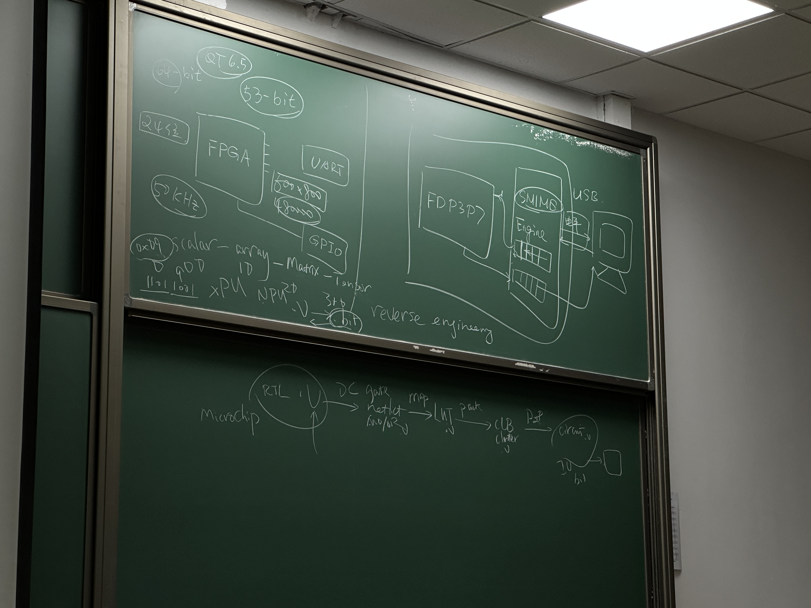
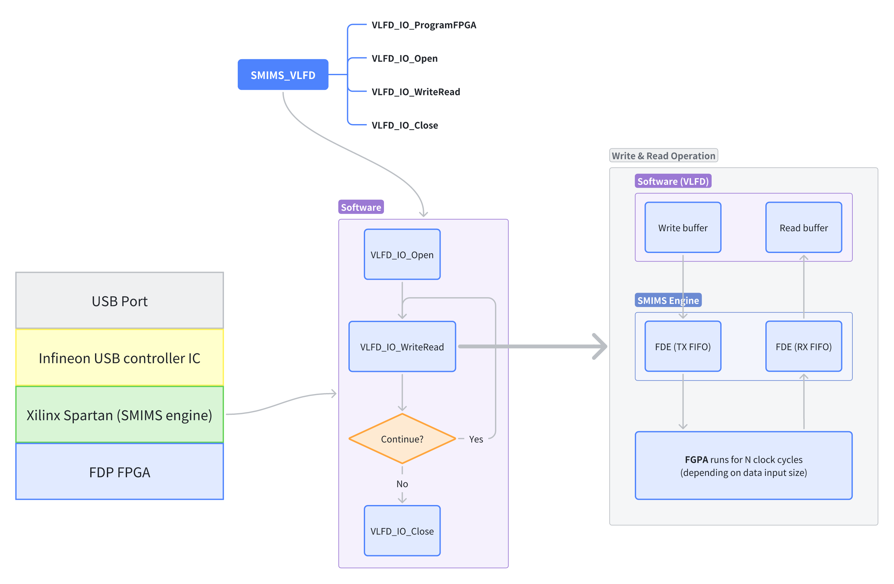
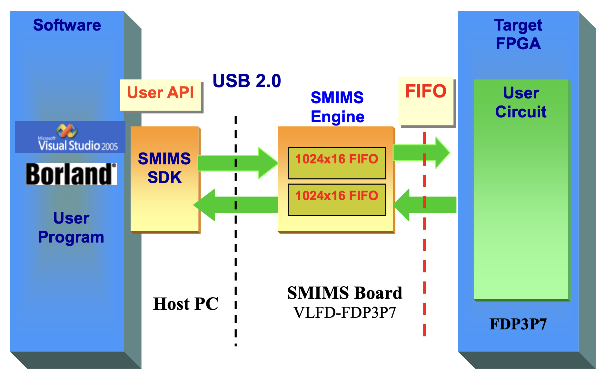
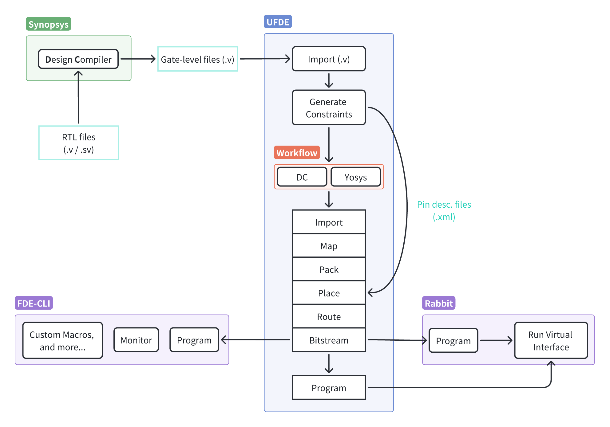

# FDE Project

<style>
body {
   /* font-family: "Times New Roman"; */
}
.times-new-roman-mono {
    font-family: monospace;
}
</style>

The FDE midterm project is a comprehensive experiment that encompasses the entire FPGA workflow, from writing RTL (Register Transfer Level) code to digital synthesis, from generating the gate file (an artifact of synthesis) to creating the bitstream, and finally, downloading the bitstream onto the FDP FPGA chip.

As a student with no background in microelectronics, all these workflows, tools, and concepts were initially foreign to me. The process of writing RTL code and performing logic synthesis to produce the gate-level code seemed daunting at first, as I had no understanding of what those terms even meant.

Throughout the course of working on this lab, I have gained significant insight into how FPGAs (or PLDs) operate—specifically their internal architectures, how they are “programmed,” and much more. Below, I have compiled my notes, key takeaways, and documentation from this learning experience.

<p align="center">
  
</p>

> A photo I took of the blackboard, during the second or third lecture, explaining the FDE workflow. At the time I still had no idea what it meant, or even what those things were.

## Background

FDE Board | FDE Board \(bird's eye view\)
:-:|:-:
|  |  |

Doing a rough inspection of the on-board components, we can observe the following components:
- [FDP3P7](#fdp3p7)
- [Xilinx Spartan XC3S200AN](#xilinx-spartan)
- [Infineon CY7C68013A-56PVXC](#infineon-cy7c68013a-56pvxc)
- [ATMEL542 IC](#atmel542-ic)
- NSK 24.00 7G
  - Is this supposed to be a 24.000MHz crystal? The spec sheet said that the internal oscillator was 30MHz.
- Some voltage regulators? \(at the side\)
- SMD capacitors and resistors
- GPIO, LEDs, buttons, PID switches, etc.


### What is [SMIMS](https://tw.smims.com.tw/)?
- 北瀚科技
- **S**mart, **M**ultiple, **I**ntegrated. **M**edia **S**ystems

> ​SMIMS Technology Corp., established in October 2004, is a **Taiwanese** company specializing in the development of hardware and software solutions for the semiconductor industry. They offer FPGA (Field-Programmable Gate Array) development platforms, such as VeriEnterprise, which integrate seamlessly with software environments like C++ and Matlab, and are particularly favored in multimedia and communications applications. Additionally, SMIMS has developed the VeriPrecision Indoor Location System (VILS), utilizing Ultra-Wideband (UWB) technology to achieve high-precision indoor positioning with an accuracy of ±20 cm. Their client base includes semiconductor design firms, integrated circuit manufacturers, and wafer fabs.
> 
> -- ChatGPT
>
> Source\(s\): [tw.smims.com.tw](https://tw.smims.com.tw/index.php?active=AboutUs&utm_source=chatgpt.com)

### FDP3P7

The FDP3P7 chips were produced in 2009 and the FDE board itself was manufactored by SMIMS, a Taiwanese Company, in 2010. Since then, no more versions of the board were manufactored ever since.

### [Xilinx Spartan](chrome-extension://efaidnbmnnnibpcajpcglclefindmkaj/https://www.xilinx.com/publications/prod_mktg/pn002011.pdf)

A non-volitile FPGA, meaning that it would retain data, or its programming, even if power is lost. I assume that the core implementation of the SMIMS engine is on here as part of their intellectual property \(or IP\).

The SMIMS engine features the following capabilities:
- 2 1024x16 FIFOs \(for bi-directional communication\)
- FPGA Control
  - It allows the **programming** and **control** of FPGA hardware via USB & API protocols
- Writing to & reading from specific pins on the FDP FPGA
- Creating a "virtual" clock for the FPGA
- And more...

### [Infineon CY7C68013A-56PVXC](https://www.infineon.com/cms/en/product/universal-serial-bus/usb-2.0-peripheral-controllers/ez-usb-fx2lp-fx2g2-usb-2.0-peripheral-controller/cy7c68013a-56pvxc/)

> USB 2.0 Peripheral controller with 16K RAM, 24 GPIOs, 56-pin SSOP for non-battery powered applications

The following summary is provided courtesy of ChatGPT:

The CY7C68013A/CY7C68014A/CY7C68015A/CY7C68016A are high-speed USB microcontrollers from Infineon, part of the **EZ-USB** FX2LP family. These controllers are designed for applications requiring USB 2.0 interface functionality and come with a range of integrated features:

- USB 2.0 Support: The controllers are USB Hi-Speed certified and support both full-speed (12 Mbps) and high-speed (480 Mbps) data transfer, ideal for fast USB communication.
- Low Power Consumption: These microcontrollers operate with ultra-low power (no more than 85 mA) in any mode, making them suitable for bus-powered and battery-operated devices.
- Embedded Microprocessor: They feature an enhanced 8051 microprocessor, running at 12 MHz, 24 MHz, or 48 MHz, capable of handling various USB communication protocols efficiently.
- Memory: They include 16 KB of on-chip program/data RAM, plus additional features like multiple FIFO buffers for handling data transfer.
- Versatile Interface: The GPIF (General Programmable Interface) allows direct connection to parallel buses, supporting a variety of external interfaces, such as ATA, EPP, and PCMCIA.
- GPIO and Communication: The microcontrollers provide flexible GPIO pins, multiple USARTs for serial communication, and I2C support.
- Applications: They are used in various devices, including portable video recorders, modems, memory card readers, cameras, scanners, and more.

**Noteworthy Takeaways:**

- 4KB Bi-directional FIFO (8 or 16 bits wide):
  - Capable of up to 96 MBytes/s burst rate.
  - The fact that the USB interface IC features a 16-bit FIFO might explain why the SMIMS engine in FDE is also 16 bits wide—having matching data widths simplifies integration and data handling between the two components.
- 24 MHz Crystal Required:
  - This clarifies the purpose of the NSK 24.000 MHz crystal on the board, which is used to provide the required clock for the microcontroller.

### ATMEL542 IC

Not exactly sure what the ATMEL 542 IC is responsible for.

### Summary

From the USB port, there are multiple layers of abstraction—at least that’s how I perceive them. The first layer is the USB interface provided by the Infineon IC, which simplifies USB 2.0 communication by leveraging mature libraries like libusb (or any other similar USB library). After this USB abstraction layer, the contents of the USB's bi-directional FIFO are exchanged with the Xilinx FPGA, which likely contains the logic enabling communication with the FDP FPGA. This interface allows us to drive VeriComm input pins on the FPGA, read logic levels from the VeriComm output pins, and perform a variety of other functions. In other words, from a high-level perspective, I see four key layers of abstraction:

1. The physical USB 2.0 port \(micro-B\)
2. The Infineon USB 2.0 interface controller IC
3. The Xilinx Spartan \(SMIMS engine\)
4. The FDP3P7 FPGA

<p align="center">
  
</p>

## Table of Contents

- [Background](#background)
- [Folder Structure](#folder-structure)
- [Experiment 1 - Name Display](#experiment-1--name-display)
- [Experiment 2](#experiment-2--rabbit--ufde-smims-engine-fde-cli--i2c)
  - Rabbit & UFDE
  - [SMIMS Engine](#smims-engine)
  - [FDE-CLI](#fde-cli)
  - [I2C](#i2c)
- [References](#references)

## Folder Structure

```
.
├── Experiment 1 Name Display
|   ├── dc                    (DC compiler files: .tcl, RTL, gate, etc.)
|       ├── name_display.tar.gz
|       └── name_display
|             └── v_src
|                  └── name_display.v       (RTL source code)
|   ├── name_display.zip          (UFDE files: cons.xml, bitstream)
|   ├── name_display_rabbit.zip   (Rabbit files: FIFO write & read raw bit files, waveform, virtual component placement, etc.)
|   ├── DEMO.mp4                  (demo video)
|   ├── gate.v
|   ├── script.ipynb          (Python script for generating partial RTL code)
│   └── README.md             (Experiment instructions)
├── Experiment 2 CUSTOM
│   └── TBD...
├── MIDTERM PRE           (PPT, PDF, etc.)
├── References
|   ├── I2C
|   └── FDE
├── PAST                  (Past FDE experiments for reference)
├── FDE-Source-main.zip   (Source code for the FDE toolset required to run UFDE)
├── Scripts
├── VERICOMM              (Detailed documentation of the VeriComm ports on the FDE board)
├── VERICOMM.zip
├── FDE实验参考.doc
└── README.md (this file)
```

## Experiment 1 | Name Display

### **Objective:**
The objective of this lab is to design a Python script that generates Verilog code for a name display project. The Verilog code will map a set of predefined sentences to a 7-segment display controlled by an FPGA. Each character in the sentence will be represented by its corresponding ASCII value, modified by subtracting 0x20 to fit into the Verilog syntax. The script automates the generation of case blocks for each sentence, which are then used to control the display.

### **Introduction:**
Verilog, a hardware description language (HDL), is used to model and design digital circuits. This project involves creating a Python script that outputs Verilog code for controlling a 7-segment display on an FPGA. The output consists of several "always" blocks, which map each character in the sentences to its corresponding hexadecimal value and then associate each value with a display register (e.g., `tmp0`, `tmp1`). Additionally, the script produces code for a multiplexer to select which sentence to display and a counter to cycle through the sentences.

### **Methodology:**

1. **Python Script Design:**
   The Python script is designed to generate Verilog code for a series of predefined sentences. The sentences are hard-coded into the script as a list of strings:
   ```python
   sentences = [
       "Hello, Fudan!",
       "Jimmy Wang or",
       "Jun Wei Wang",
       "From school of Software!"
   ]
   ```
   The script uses a function `generate_verilog_block` to create Verilog code for each sentence. This function iterates through each character in the sentence, computes its mapped hexadecimal value (by subtracting 0x20 from its ASCII value), and generates the corresponding case block for Verilog. Each character is associated with an index, represented in hexadecimal format, which is used to display the character on the 7-segment display.

2. **Generating Verilog Code:**
   - For each sentence, the function produces a Verilog case block that assigns a value to a temporary register (e.g., `tmp0`) based on the `cnt_lcd[5:1]` value.
   - Each Verilog block is formatted with comments indicating the character being mapped.
   - A multiplexer is generated to select which sentence is active, based on a sentence selector (`sentence_sel`).
   - A counter is implemented to increment `cnt_lcd` and update `sentence_sel` on each clock cycle.

3. **Output:**
   The script outputs the Verilog code, which consists of:
   - Case blocks for each character in the sentences.
   - A multiplexer to select the active sentence based on the sentence selector.
   - A counter to cycle through the sentences.

### **Results:**
The Python script successfully generates Verilog code for the four predefined sentences. Below is the Verilog code generated for the sentence "Hello, Fudan!":

```verilog
// Case block for tmp0 representing "Hello, Fudan!"
always @(cnt_lcd)
   case(cnt_lcd[5:1])
   'h0 : tmp0 = 'h28;    // H
   'h1 : tmp0 = 'h45;    // e
   'h2 : tmp0 = 'h4C;    // l
   'h3 : tmp0 = 'h4C;    // l
   'h4 : tmp0 = 'h4F;    // o
   'h5 : tmp0 = 'h0C;    // ,
   'h6 : tmp0 = 'h00;    // space
   'h7 : tmp0 = 'h26;    // F
   'h8 : tmp0 = 'h55;    // u
   'h9 : tmp0 = 'h44;    // d
   'hA : tmp0 = 'h41;    // a
   'hB : tmp0 = 'h4E;    // n
   'hC : tmp0 = 'h01;    // !
   default : tmp0 = 'h00;
   endcase
```

The generated code maps each character to its corresponding register (`tmp0`), and the multiplexer selects which register to output based on the `sentence_sel` value. The counter (`cnt_lcd`) cycles through each character in the sentence.

---

#### **Discussion:**
The Python script automates the process of writing Verilog code for each predefined sentence. This significantly reduces the manual effort required to create multiple case blocks for each character in the sentence. The generated Verilog code is modular and can be easily modified to accommodate additional sentences or different display configurations.

Additionally, the script allows for flexibility in mapping different sentences to different temporary registers (e.g., `tmp0`, `tmp1`), and the multiplexer ensures that only one sentence is displayed at a time. The counter logic ensures that the system cycles through the characters in the selected sentence.

---

#### **Conclusion:**
The Python script successfully generates Verilog code for a name display project, automating the tedious process of manually writing case blocks for each character in the sentence. The generated Verilog code includes the necessary case blocks, multiplexer, and counter to control the 7-segment display. This approach can be extended to larger projects involving dynamic sentence selection or more complex display systems. The script is a useful tool for FPGA developers working with text-based display systems. 

---

#### **Future Work:**
Future improvements to the script may include:
- Adding functionality to dynamically generate sentences based on user input.
- Implementing additional display logic, such as scrolling or animation.
- Optimizing the counter and multiplexer for larger sentence sets or higher resolution displays.

---

#### **References:**
- Python Documentation: https://docs.python.org/3/
- Verilog Language Reference Manual: https://www.asic-world.com/verilog/

## Experiment 2 | Rabbit & UFDE, SMIMS Engine, FDE-CLI, & I2C

During the first part of the 

# SMIMS Engine



> From pg.1 of `VLFD-USB-FDP3P7-Software-Development-Kits-user-guide-1.1.0_EN_.pdf`

In the diagram, we can see that there are two FIFOs, each with dimensions of 1024 by 16; each row is **16 bits wide** and there are 1024 rows.

- Each row can store up to 2 bytes \(2 * 8 bits\) of data
- 2 bytes * 1024 = 2048 bytes (2.048 Kb)

Therefore, each FIFO has around 2Kb of storage. There are two FIFOs because they need to handle **bi-directional** data transfer \(a transmitter & receiver\).

For the sake of convenience and consistancy, I am going to addresss the user program to FPGA FIFO, left to right, as the transmit FIFO \(or TX FIFO\), and the FPGA to user program FIFO as recieve FIFO \(RX FIFO\).3

## Demo of how data is _exchanged_ between the user program & SMIMS engine

The Rabbit program provides some debugging files so that we can see a record of what is going on under the hood. Specifcally, there are **three files** that would appear in the root of your Rabbit project folder:

- `RabbitReadData.txt`, data **read from** the FIFO
- `RabbitWritedData.txt`, data **sent to** the SMIMS engine
- `RabbitWaveForm.vcd`

> These files can be found in the Rabbit root project folder \(with the `.rbtprj`\) file.

To get a better understanding of how data is exchanged, let's take a look at the contents of the first two files \(the read data & write data .txt files\):

```
0000000000111111111111111111111111111111111111111111011000101000
0000000000111111111111111111111111111111111111111111011100000000
0000000000111111111111111111111111111111111111111111011001000101
0000000000111111111111111111111111111111111111111111011100000000
...
```
> The **first four rows** from `RabbitReadData.txt`, based on the mandatory name display lab

We can make the following observations from the data we see here:
- Each line contains 64 bits of data read from the RX FIFO
- For every 64 bits of data sent to the TX FIFO, we get 64 bits back \(from the RX FIFO\)
- Each line \(or every 64 bits\) is **one clock cycle**
- I assume that for every set of 8 bytes \(64 bits\) sent to the TX FIFO of the SMIMS engine:
  1. Its "virtual clock" ticks once
  2. FPGA output pins are sampled by the SMIMS engine
  3. Then another 8 bytes \(64 bits\) of data is ready to be read from the RX FIFO \(contains the data that were sampled\)
  > This is how I **assume** the SMIMS engine works, there is no official documentation on its inner-workings or the source code \(only driver code is readily available\).

Here is the constraints file \(.xml\) for the name display lab:
```xml
<design name="name_display">
  <port name="lcd_db[0]" position="P7"/>
  <port name="lcd_db[1]" position="P6"/>
  <port name="lcd_db[2]" position="P5"/>
  <port name="lcd_db[3]" position="P4"/>
  <port name="lcd_db[4]" position="P9"/>
  <port name="lcd_db[5]" position="P8"/>
  <port name="lcd_db[6]" position="P16"/>
  <port name="lcd_db[7]" position="P15"/>
  <port name="clk" position="P77"/>
  <port name="rst" position="P151"/>
  <port name="lcd_en" position="P11"/>
  <port name="lcd_rst" position="P18"/>
</design>
```

> `name_display_cons.xml`
>
> There are 8 ports \(lcd_db\[0\]~lcd_db\[7\]) for the data lines of the text LCD, they are connected to pins P7~P15, even though the number on the pin does not appear to be in order, they are in fact the first 8 bits of the data read.
> 
> Why? Consult the VeriComm documentation manual and `VERICOMM_MAP_EXT.xlsx`, especially the section about the mapping of VeriComm pins to the physical FPGA pins.

Organizing the raw 64-bit data into groups of bytes:
<div class="times-new-roman-mono">

| 4 | 3 | 2 | 1 |
| - | - | - | - |
| 00000000 00111111 | 11111111 11111111 | 11111111 11111111 | 11110110 <mark>00101000</mark> |
| 00000000 00111111 | 11111111 11111111 | 11111111 11111111 | 11110111 <mark>00000000</mark> |
| 00000000 00111111 | 11111111 11111111 | 11111111 11111111 | 11110110 <mark>01000101</mark> |
| 00000000 00111111 | 11111111 11111111 | 11111111 11111111 | 11110111 <mark>00000000</mark> |

</div>

Observe the changes in first byte of the first set of data \(highlighted in yellow\) read from the FIFO:

| Raw | Hex |
| - | - |
| 00101000 | 0x28 |
| 00000000 | 0x00 |
| 01000101 | 0x45 |
| 00000000 | 0x00 |

Taking a little peak into our RTL \(.v\) file:
```verilog
always @(cnt_lcd)
   case(cnt_lcd[5:1])
   'h0 : tmp0 = 'h28;    // H
   'h1 : tmp0 = 'h45;    // e
   'h2 : tmp0 = 'h4C;    // l
   'h3 : tmp0 = 'h4C;    // l
   'h4 : tmp0 = 'h4F;    // o
```

We can see that the bits we observed from the outputsFIFO reflects what is being written to the `lcd_db` data lines. We can expect to see `0x4C` if we were to decode two more lines from `RabbitReadData.txt`.

Hopefully, through this example you gained some insight into what the data inside of the two files mean, how to interpret them, and a brief understanding of how the SMIMS engine works.

## How the SMIMS engine works \(roughly\)


From the software perspective:


## Maximum Theoretical Frequency

Maximum USB2 transfer rate: $480 \text{Mbps} = 4.8 * 10^{8} \text{bits/second}$

When flow control, packet framing and protocol **overhead** are considered, 
it is realistic for about two-thirds of the raw throughput, 
or $330 \text{Mbps}$ \($3.2*10^8 \text{bits/second}$\) to transmit to an application.

$$
\frac{3.2*10^8 \text{bits}}
{second} \cdot
\frac{1}
{1024 \times 16 \text{bits}}
=
\frac{23193.36}
{\text{second}}
\approx
\frac{23,000}
{second}
$$

In other words, we can populate the FIFO 23,000 times per second.

Because every $64 \text{bits}$ put in the FIFO represents one clock cycle, each full FIFO contains $1024 * 16 \text{bits} \div 64 \text{bits} = 256$ clock cycles.

This gives us a theoretical maximum of $23000 \cdot 256 = 5888000 \text{Hz}$ or **$5.888 \text{Mhz}$** give or take on the basis that we can saturate the full USB2 bandwidth, the SMIMS engine supports this transfer speed, and our design won't encounter any timing issues.

## Batch Write

# FDE-CLI



- Interact with more than one FDE board \(should work with an arbitrary number of FDE boards\)
- Reimplemented USB driver in Rust
  - Supports all VLFD features \(IO_Open, IO_WriteRead, IO_Close, etc.\)
- Project manager
- CLI interface

# I2C

## References
- [My I2C Blog on GitBook](https://junweiwangs-organization.gitbook.io/fpga-stuff/i2c-protocol)

# References

- 
- https://nandland.com/tri-state-bidirectional-buffers-not-synthesizing-heres-why/